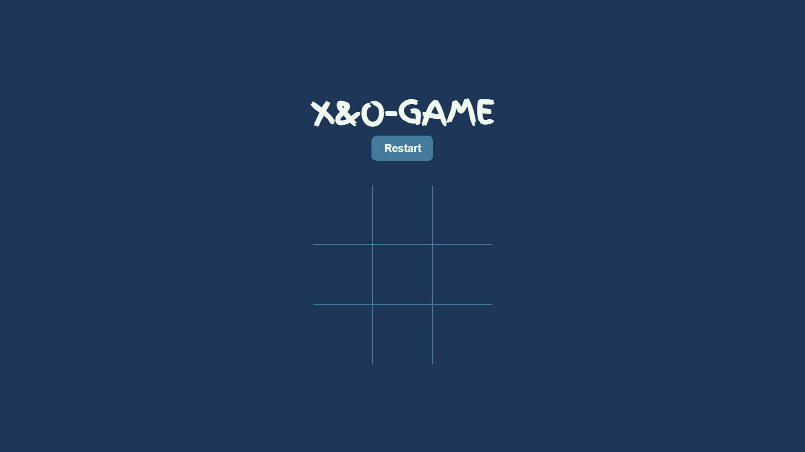
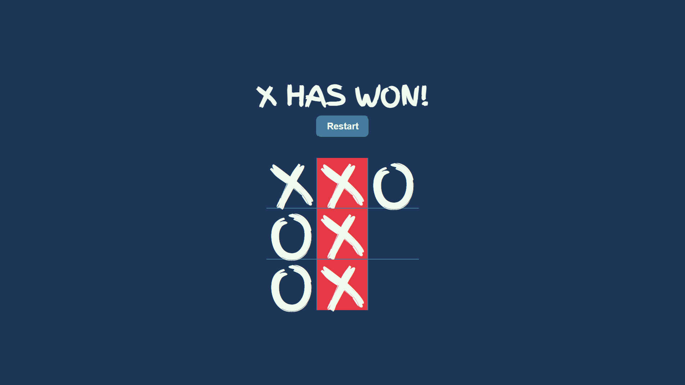
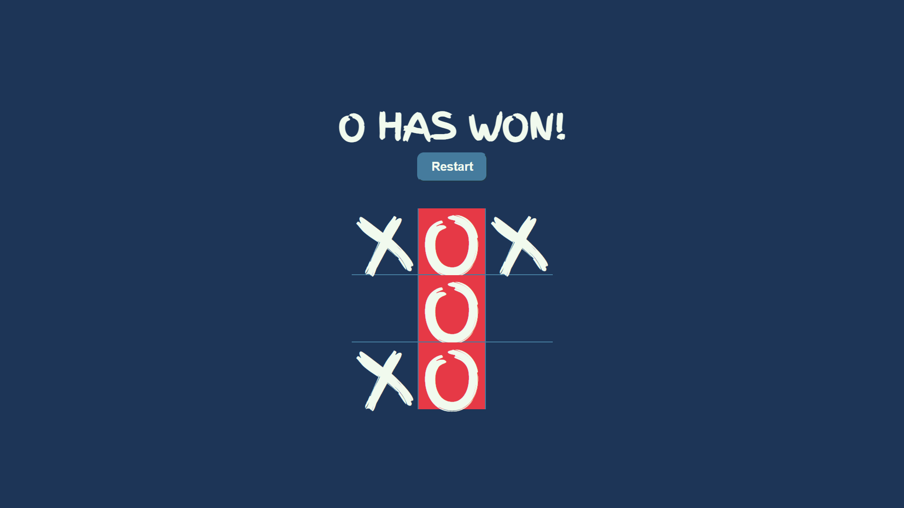
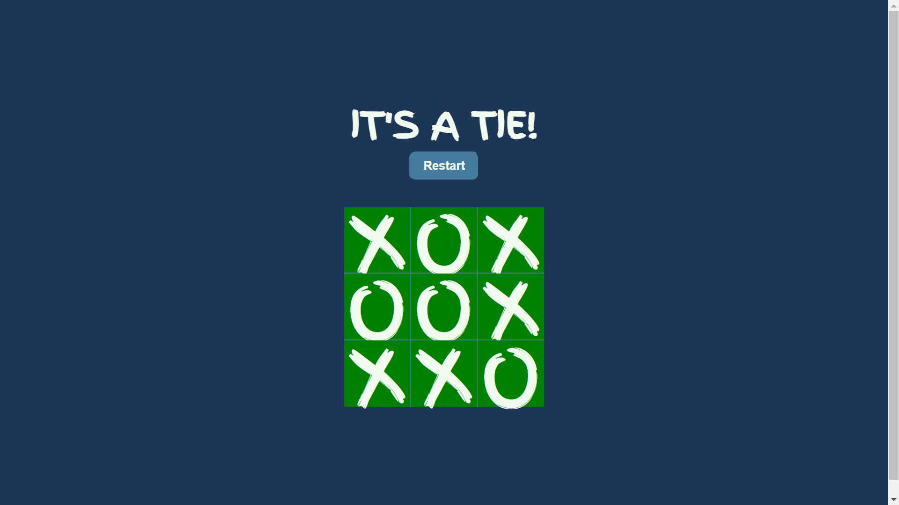

# Tic-Tac-Toe AI Game

This project is a web-based Tic-Tac-Toe game where you can play against an AI opponent. The AI uses the Minimax algorithm to ensure a challenging game. The project is built using HTML, CSS, and JavaScript, and it features a responsive design, sound effects, and winning/tie detection.

## Features

- **Play Against AI**: Challenge yourself by playing against an AI that uses the Minimax algorithm to always make the best move.
- **Sound Effects**: Enjoy click sound effects with every move, enhancing the user experience.
- **Winning/Tie Detection**: The game automatically detects when a player wins or when the game ends in a tie, with appropriate messages and visual effects.
- **Responsive Design**: The gameboard is designed to be responsive, ensuring it looks good on both desktop and mobile devices.
- **Restart Option**: Easily start a new game at any time using the "Restart" button.

## Screenshots

Below are some screenshots showing different stages of the game:

### 1. Initial Game Screen


### 2. Player X Wins


### 3. Player O Wins


### 4. It's a Tie


*Note: Screenshots should be placed in the `screenshots` directory of your project. Replace the placeholders with actual images from your game.*

## Project Structure

- `index.html`: The main HTML file that structures the game.
- `Style.css`: The CSS file that defines the styles for the game interface.
- `Script-with-AI.js`: The JavaScript file containing the game logic and AI implementation.
- `Click-Sound/click-button-140881.mp3`: The sound file used for click effects.
- `screenshots/`: Directory containing screenshots of the game.

## Technologies Used

- **HTML5**: For structuring the web page.
- **CSS3**: For styling the gameboard and layout.
- **JavaScript**: For implementing the game logic, AI behavior, and interaction handling.

## Acknowledgments

- The AI opponent uses the Minimax algorithm, making the game challenging and educational.

### Installation

1. Clone this repository to your local machine using the following command:
   ```bash
   git clone https://github.com/MoSalem149v2/tic-tac-toe-AI.git
